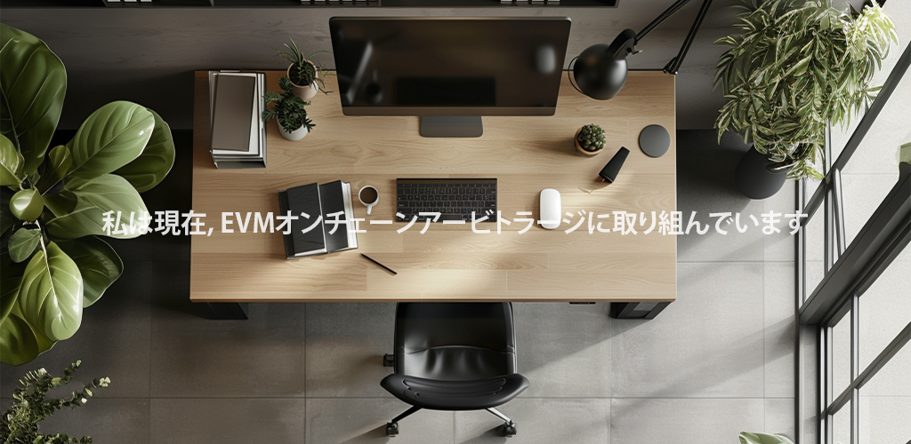

  

<h2 align='center'>私のスタック</h2>

  

    
  

  

    
    
    
    
    
    
    
    
    
    
    
    
  

  

    
  

  

    
    
    
    
  

  

    
  

  

    
    
    
    
    
    
  

  

    
  

  

    
    
    
  

  
他の

  

    
    
    
    
    
    
    
    
    
    
  

  

  

